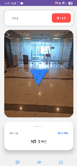

# 🧭 Indoor AR Navigation System  
### 머신비전 기반 실내 길안내 및 방향 안내 UI 시스템

> **사용자의 현재 위치와 바라보는 방향을 인식하여, 목적지까지의 이동 경로를 실시간으로 안내하는 실내 AR 네비게이션 시스템**
>  
> 카메라 영상 기반 방향 분류 모델과 경로 안내 로직, 그리고 직관적인 UI/UX를 결합하여  
> 복잡한 실내 공간에서도 사용자가 쉽게 목적지까지 이동할 수 있도록 설계하였습니다.

---

## 📌 Project Overview

실내 공간에서는 GPS 신호가 약하거나 부정확하여, 일반적인 지도 기반 길찾기 서비스를 그대로 적용하기 어렵습니다.  
본 프로젝트는 이러한 한계를 해결하기 위해, **카메라 기반 방향 인식 모델**과 **실내 목적지 경로 매핑 로직**,  
그리고 **사용자 친화적인 방향 안내 UI**를 결합한 **실내 AR 길안내 시스템**을 구현한 프로젝트입니다.

사용자는 모바일 기기 또는 카메라 화면을 통해 현재 시야를 비추고,  
시스템은 이를 바탕으로 **현재 위치/방향을 판단한 뒤 목적지까지의 다음 이동 명령(직진, 좌회전, 우회전, 후진)** 을 안내합니다.

---

## 🎯 Goals

- 실내 공간에서 GPS 없이도 사용할 수 있는 길안내 시스템 구현
- 머신비전 기반으로 사용자의 현재 방향 자동 인식
- 목적지별 경로를 직관적인 UI로 실시간 안내
- 모바일/PC 간 통신 및 시각적 피드백을 통한 사용자 경험 향상
- 시연 가능한 형태의 프로토타입 구축

---

## ✨ Key Features

- 📷 **카메라 기반 현재 방향 인식**
  - 사용자의 시야 이미지를 입력받아 현재 방향 또는 위치 구간 분류
- 🧠 **머신러닝/딥러닝 기반 방향 판단**
  - 실내 구역 및 방향 데이터셋을 기반으로 학습된 모델 사용
- 🗺️ **목적지별 경로 안내 로직**
  - 목적지에 따라 이동해야 할 방향을 단계별로 제공
- 🔁 **실시간 방향 변환 로직**
  - 현재 바라보는 방향과 목표 방향을 비교해  
    `직진 / 좌회전 / 우회전 / 후진` 중 하나로 변환
- 🎨 **직관적인 UI/UX**
  - 사용자가 즉시 이해할 수 있는 큰 방향 표시
  - 이동 상태에 따른 UI 변화 및 시각 효과 적용
- 📱 **모바일-서버-모델 연동**
  - 촬영 이미지 전송 → 서버 추론 → 결과 반환 → UI 갱신 구조
- 🌌 **몰입감 있는 시각 디자인**
  - AR/네비게이션 느낌을 살린 방향 안내 인터페이스 구현

---

## 🖼️ Demo

### 1. 전체 시연 영상 - web
[](./flask기반%20web시연.mp4)

### 2. 전체 시연 영상 - app
[](./APP_시연1.mp4)

---

## 🏗️ System Architecture


### 시스템 구성 흐름

1. **사용자**가 모바일/카메라로 현재 위치의 화면을 촬영
2. 촬영된 이미지가 **서버**로 전송됨
3. 서버는 학습된 **방향 분류 모델**을 이용해 현재 위치/방향을 예측
4. 예측 결과를 기반으로 현재 상태를 판단
5. 사용자가 선택한 **목적지 정보**와 현재 방향을 비교
6. 경로 로직을 통해 다음 이동 명령 생성
7. UI에 `직진 / 좌회전 / 우회전 / 후진` 중 하나를 시각적으로 표시
8. 사용자는 안내에 따라 이동하고, 반복적으로 다음 경로를 안내받음

---

## 🧩 Core Logic

### 1) 현재 방향 인식
카메라로 입력된 실내 이미지에서 사용자의 현재 방향 또는 구역을 인식합니다.  
이 과정은 학습된 이미지 분류 모델을 통해 수행됩니다.

### 2) 목적지 매핑
각 목적지는 특정 구역 또는 방향 기준으로 매핑되어 있으며,  
현재 위치와 목적지 정보를 비교하여 다음 이동 방향을 결정합니다.

### 3) 방향 변환 로직
현재 방향과 다음 목표 방향을 비교하여 실제 사용자에게 보여줄 명령을 생성합니다.

예시 로직:

```python
TURN_MAP = {
    ("N", "N"): "직진",
    ("N", "E"): "우회전",
    ("N", "S"): "후진",
    ("N", "W"): "좌회전",

    ("E", "N"): "좌회전",
    ("E", "E"): "직진",
    ("E", "S"): "우회전",
    ("E", "W"): "후진",

    ("S", "N"): "후진",
    ("S", "E"): "좌회전",
    ("S", "S"): "직진",
    ("S", "W"): "우회전",

    ("W", "N"): "우회전",
    ("W", "E"): "후진",
    ("W", "S"): "좌회전",
    ("W", "W"): "직진",
}

```

이 로직을 통해 사용자는 복잡한 절대 방향(N/E/S/W)이 아니라,  
즉시 이해 가능한 행동 중심 명령을 받을 수 있습니다.

## 🛠 Tech Stack

### AI / Vision
- Python
- PyTorch
- OpenCV
- NumPy
- 이미지 분류 모델

### Backend / Communication
- Python
- Flask
- REST API
- JSON 기반 데이터 송수신

### Frontend / UI
- HTML / CSS / JavaScript  
또는
- React

### Development Environment
- VS Code
- Ubuntu / WSL
- Git / GitHub

> 실제 프로젝트 구조에 맞춰 수정하면 됩니다.

## 🧠 Model Training

실내 구역 및 방향별 이미지를 수집하여 데이터셋을 구성하고,  
각 방향/위치 클래스를 분류할 수 있도록 모델을 학습했습니다.

### 데이터셋 구성 예시
- 클래스: `1_E`, `1_W`, `2_N`, `3_S` ...

### 의미
- 숫자: 구역(위치)
- 문자: 방향(N/E/S/W)

즉, 모델은 단순히 “장소”만 분류하는 것이 아니라,  
같은 공간이라도 어느 방향을 보고 있는지까지 함께 판단하도록 설계되었습니다.

### 학습 목표
- 현재 위치 구간 인식
- 현재 시야 방향 인식
- 경로 안내 로직에 활용 가능한 수준의 분류 정확도 확보

## 🚀 How It Works

### Step 1. 목적지 선택
사용자가 도착하고 싶은 목적지를 선택합니다.

### Step 2. 현재 화면 입력
사용자는 현재 위치의 화면을 카메라로 촬영합니다.

### Step 3. 방향 예측
서버는 입력 이미지를 바탕으로 현재 위치/방향을 예측합니다.

### Step 4. 경로 계산
현재 상태와 목적지를 비교하여 다음 동작을 계산합니다.

### Step 5. UI 안내
화면에는 다음과 같은 명령 중 하나가 표시됩니다.

- 직진
- 좌회전
- 우회전
- 후진

### Step 6. 반복 안내
사용자가 이동한 후 다시 현재 화면을 입력하면,  
목적지에 도달할 때까지 위 과정을 반복합니다.

## 🎨 UI/UX Design

본 프로젝트에서는 단순히 기능 구현에 그치지 않고,  
사용자가 즉시 행동할 수 있는 인터페이스를 만드는 데 중점을 두었습니다.

### UI 설계 포인트
- 큰 크기의 방향 텍스트 및 아이콘
- 한눈에 보이는 현재 이동 명령
- 직진/좌회전/우회전/후진 상태에 따른 시각적 변화
- 실내 네비게이션 특성에 맞춘 몰입감 있는 디자인
- 사용자의 혼동을 줄이기 위한 최소 정보 중심 구성

## 📈 Expected Effects

- 실내에서의 위치 안내 편의성 향상
- 학교, 병원, 전시장, 공공기관 등 복잡한 실내 공간에 적용 가능
- 시각 기반 안내 시스템으로 확장 가능
- 향후 AR 글래스/모바일 앱과의 연계 가능성 확보

## ⚠ Challenges & Improvements

### Challenges
- 실내 조명 변화에 따른 이미지 인식 성능 변화
- 비슷한 복도/구역 간 시각적 유사성 문제
- 모바일 촬영 각도와 흔들림에 따른 추론 오차
- 실시간성 확보와 UI 반응속도 개선 필요

### Future Work
- 실시간 영상 스트림 기반 방향 인식
- AR 오버레이 화살표 표시 기능 추가
- 사용자 위치 추정 정확도 향상
- 목적지까지의 전체 경로 시각화
- 모바일 앱 형태로 확장
- 다양한 건물 구조에 대한 일반화 성능 개선

## 📚 What I Learned

이 프로젝트를 통해 단순히 모델 정확도를 높이는 것보다,  
실제 사용자가 이해하고 따라갈 수 있는 형태로 결과를 전달하는 것이 더 중요하다는 점을 배웠습니다.

또한,

- 머신비전 모델과 실제 서비스 로직을 연결하는 방법
- 현재 상태와 목표 상태를 비교해 행동 지시로 변환하는 방식
- 사용자 중심 UI/UX 설계의 중요성
- 이미지 분류 모델과 프론트엔드/백엔드 통합 경험

을 직접 경험할 수 있었습니다.

## 👩‍💻 My Role

- 프로젝트 아이디어 구체화
- 실내 방향 인식용 데이터셋 구성
- 이미지 분류 모델 학습 및 추론 로직 구현
- 목적지 매핑 및 방향 변환 로직 설계
- UI/UX 설계 및 방향 안내 인터페이스 구현
- 시스템 전체 흐름 통합 및 시연 구성

## 📌 Keywords

`Indoor Navigation` `AR Navigation` `Machine Vision` `Image Classification` `Direction Recognition` `UI/UX` `Flask` `Python` `OpenCV` `PyTorch`

## 📞 Contact

**박소윤**  
Embedded Systems / AI Vision / Smart Mobility / Smart Factory  
GitHub: [psy1218](https://github.com/psy1218)

