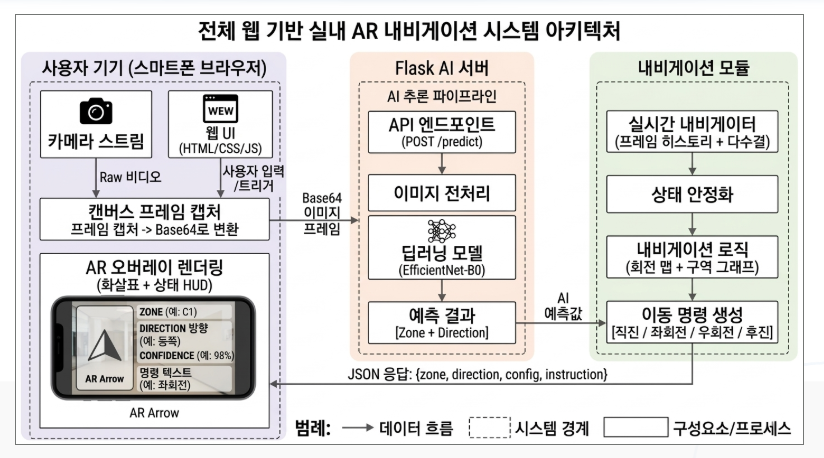
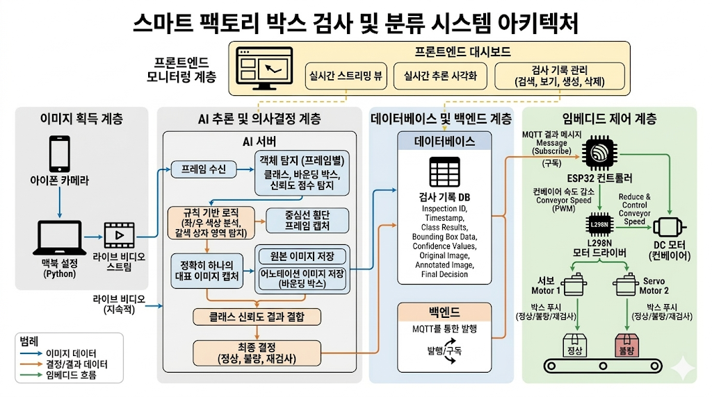
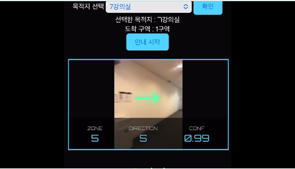
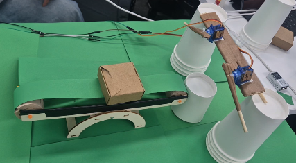

# 🧠 AI Vision Projects Portfolio

> 머신비전 기반 문제 해결을 목표로,  
> **실내 AR 길안내 시스템**과 **스마트 팩토리 박스 품질 검사 및 분류 시스템**을 설계·구현한 프로젝트 모음입니다.  
> 두 프로젝트 모두 단순 모델 개발에 그치지 않고, **실제 사용 흐름과 시스템 동작까지 연결하는 것**에 집중했습니다.

---

## 📌 Project Summary

| Project | Description | Tech |
|--------|-------------|------|
| [🧭 Indoor AR Navigation System](https://github.com/psy1218/HYUNDAI_AUTOEVER_BOOTCAMP_Machine_Vision_Projectz/tree/main/AR_navigation) | 실내 공간에서 카메라 기반 방향 인식과 경로 안내 로직을 활용해 목적지까지 직관적으로 안내하는 AR 네비게이션 시스템 | Python, Flask, Image Classification, UI/UX |
| [📦 Smart Factory Box Quality Inspection & Sorting System](https://github.com/psy1218/HYUNDAI_AUTOEVER_BOOTCAMP_Machine_Vision_Projectz/tree/main/smart_factory) | 박스 외관 결함을 비전 모델로 검사하고, MQTT 및 ESP32 제어를 통해 정상/불량/재검사를 자동 분류하는 스마트 팩토리 시스템 | Python, YOLO, MQTT, ESP32, OpenCV |

---

## 🏗️ System Architecture
### AR 네비게이션 

### 스마트 팩토리 박스 품질 검사 및 분류 시스템 

## 🏗️ 시연 영상
### AR 네비게이션 

### 스마트 팩토리 박스 품질 검사 및 분류 시스템 

---

## [🧭 Indoor AR Navigation System](https://github.com/psy1218/HYUNDAI_AUTOEVER_BOOTCAMP_Machine_Vision_Projectz/tree/main/AR_navigation)

### 프로젝트 개요
실내 환경에서는 GPS 기반 길안내가 어렵기 때문에,  
카메라 입력 영상으로 현재 위치와 방향을 인식하고 목적지까지의 이동 방향을 실시간으로 안내하는 시스템을 구현했습니다.

이 프로젝트는 단순히 위치를 인식하는 데서 끝나지 않고,  
사용자가 즉시 이해할 수 있도록 **직진 / 좌회전 / 우회전 / 후진**과 같은 행동 중심 명령으로 변환해 안내하는 데 중점을 두었습니다.

### 왜 만들었는가
- 실내에서는 일반적인 지도 기반 네비게이션의 한계가 큼
- 사용자에게 복잡한 좌표나 방향값이 아닌, 바로 행동 가능한 정보 제공이 필요함
- 머신비전 모델을 실제 사용자 경험(UI/UX)과 연결하는 흐름을 구현해보고자 함

### 핵심 기능
- 실내 이미지 기반 현재 위치/방향 분류
- 목적지 선택에 따른 경로 안내
- 절대 방향을 행동 명령으로 변환하는 로직 적용
- 직관적인 UI/UX로 길안내 시각화
- 카메라 입력 → 서버 추론 → 결과 반환 → UI 반영 흐름 구현

### 사용 기술
- **AI / Vision**: Python, PyTorch, OpenCV, NumPy
- **Backend**: Flask, REST API
- **Frontend / UI**: HTML, CSS, JavaScript
- **Development**: VS Code, Ubuntu/WSL, GitHub

### 내가 맡은 역할
- 프로젝트 아이디어 구체화 및 전체 방향 설정
- 실내 방향 인식용 데이터셋 구성
- 이미지 분류 모델 학습 및 추론 흐름 설계
- 현재 방향과 목표 방향을 비교하는 경로 로직 구현
- 사용자가 즉시 이해할 수 있는 UI/UX 설계
- 시연 가능한 형태로 전체 시스템 통합

### 이 프로젝트에서 강조하고 싶은 점
이 프로젝트를 통해  
**“모델이 무엇을 예측했는가”보다 “사용자가 그 결과를 어떻게 받아들이고 바로 행동할 수 있는가”가 더 중요하다**는 점을 배웠습니다.  
즉, AI 결과를 실제 사용자 경험으로 바꾸는 시스템 설계 역량을 보여준 프로젝트입니다.

---

## [📦 Smart Factory Box Quality Inspection & Sorting System](https://github.com/psy1218/HYUNDAI_AUTOEVER_BOOTCAMP_Machine_Vision_Projectz/tree/main/smart_factory)

### 프로젝트 개요
제조 현장에서 박스 외관의 찢김, 구멍, 개봉 상태 등의 이상 여부를 머신비전으로 판별하고,  
그 결과를 MQTT 통신과 ESP32 하드웨어 제어로 연결하여 **정상 / 불량 / 재검사**로 자동 분류하는 스마트 팩토리 프로토타입을 구현했습니다.

이 프로젝트는 단순 결함 탐지를 넘어,  
**비전 검사 → 상태 판단 → 설비 제어 → 자동 분류**까지 이어지는 end-to-end 흐름을 직접 구현한 것이 핵심입니다.

### 왜 만들었는가
- 제조 공정의 수작업 품질 검사는 피로도와 판정 편차가 큼
- 비전 기반 검사 결과가 실제 자동화 설비와 연결되어야 스마트 팩토리적 의미가 생김
- AI 모델과 임베디드 제어를 하나의 시스템으로 통합하는 경험이 필요했음

### 핵심 기능
- YOLO 기반 박스 결함 검출
- 프레임 단위가 아닌 세션 단위 최종 판정 로직
- `NORMAL`, `DEFECTIVE`, `RECHECK` 상태 분류
- MQTT 기반 서버-ESP32 실시간 통신
- DC 모터 및 서보모터 제어를 통한 자동 분류
- 카메라 → 추론 → 판정 → 전송 → 하드웨어 동작의 전체 흐름 구현

### 사용 기술
- **AI / Vision**: Python, YOLO, PyTorch, OpenCV, NumPy
- **Communication**: MQTT, PubSubClient
- **Embedded / Control**: ESP32, Arduino IDE, ESP32Servo, DC Motor, L298N, Servo Motor
- **Development**: VS Code, Ubuntu/WSL, GitHub

### 내가 맡은 역할
- 프로젝트 아이디어 구체화 및 전체 시스템 설계
- 품질 검사 모델 적용 및 추론 흐름 설계
- 세션 기반 최종 판정 로직 구현
- MQTT 통신 구조 설계
- ESP32 기반 컨베이어/서보 제어 로직 구현
- 비전 결과와 실제 분류 동작의 시스템 통합
- 시연 구조 설계 및 테스트 진행

### 이 프로젝트에서 강조하고 싶은 점
이 프로젝트는 단순히 결함을 잘 찾는 모델을 만든 것이 아니라,  
**AI 결과를 실제 공정 제어로 연결해 자동 분류까지 구현했다는 점**에서 의미가 큽니다.  
즉, 머신비전, 통신, 임베디드 제어를 통합해 **현장형 자동화 시스템**으로 확장한 프로젝트입니다.

---

## 🧩 What These Projects Show

두 프로젝트는 분야는 다르지만 공통적으로 다음 역량을 보여줍니다.

- 머신비전 모델을 실제 문제 해결 흐름에 연결하는 능력
- 단순 예측 결과를 사용자 행동 또는 설비 제어로 변환하는 시스템 설계 능력
- Python 기반 AI 개발과 실시간 응용 시스템 통합 경험
- UI/UX 또는 임베디드 제어까지 포함한 end-to-end 구현 경험
- “모델 정확도”를 넘어서 “실제 동작 가능한 시스템”을 만드는 역량

---

## 👩‍💻 My Role

저는 두 프로젝트에서 공통적으로  
**아이디어 구체화 → 데이터 구성 → 모델 적용 → 로직 설계 → 시스템 통합 → 시연 구성**의 전 과정을 주도적으로 수행했습니다.

특히 다음과 같은 역할에 집중했습니다.

- 문제를 기술적으로 해결 가능한 구조로 정의하는 역할
- 머신비전 모델이 실제 서비스나 설비 동작으로 이어지도록 연결하는 역할
- 사용자가 이해하기 쉬운 인터페이스 또는 공정 친화적인 판정 로직을 설계하는 역할
- AI, 백엔드, 통신, 하드웨어를 하나의 흐름으로 통합하는 역할

즉, 저는 단순히 모델을 학습시키는 개발이 아니라,  
**AI가 실제로 작동하는 전체 시스템을 설계하고 구현하는 역할**을 맡았습니다.

---

## 🛠 Main Tech Keywords

`Machine Vision` `Image Classification` `YOLO` `PyTorch` `OpenCV` `Flask` `MQTT` `ESP32` `Automation` `Smart Factory` `UI/UX` `Embedded Control`

---

## 📞 Contact

**박소윤**  
Embedded Systems / AI Vision / Smart Factory / Smart Mobility  
GitHub: [psy1218](https://github.com/psy1218)