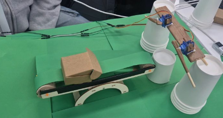
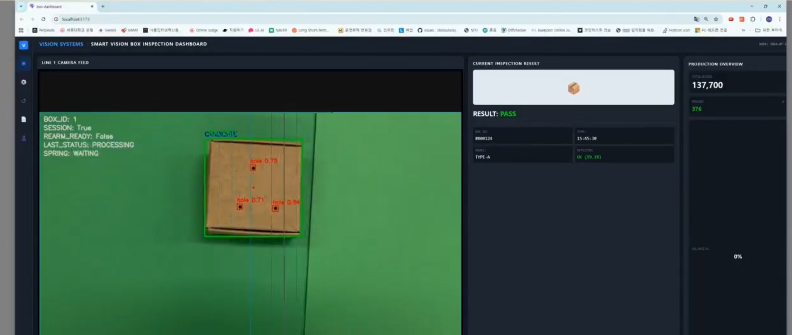
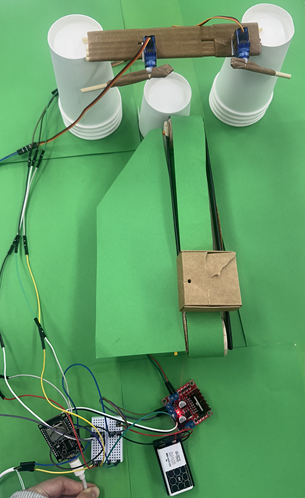
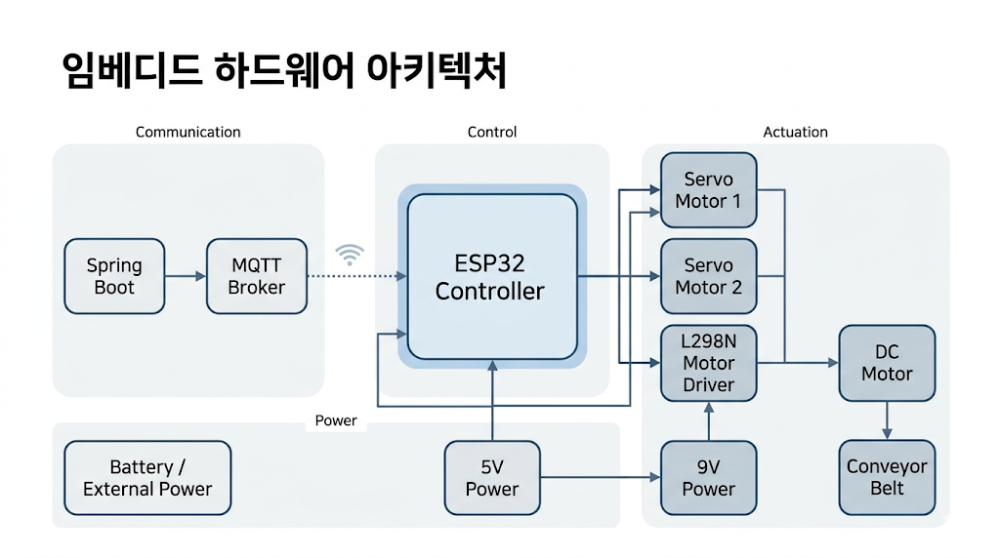
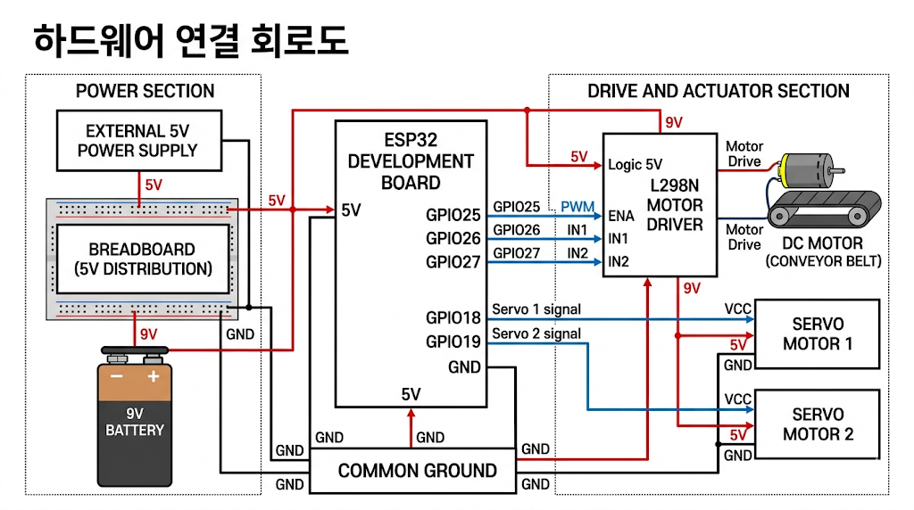

# 📦 Smart Factory Box Quality Inspection & Sorting System

> **머신비전 기반 박스 품질 검사와 자동 분류를 결합한 스마트 팩토리 프로토타입**
>
> 카메라 영상에서 박스의 상태를 판별하고, 검사 결과를 바탕으로 컨베이어 및 액추에이터를 제어하여  
> **정상 / 불량 / 재검사** 상태에 따라 자동 분류가 이루어지도록 설계한 시스템입니다.

---

## 📌 Project Overview

제조 현장에서는 포장 박스의 찢김, 구멍, 개봉 상태, 외관 손상과 같은 품질 이상을 빠르게 검출하고,  
그 결과를 즉시 생산 라인에 반영하는 것이 매우 중요합니다.  
기존 수작업 검사는 작업자 피로도, 판단 편차, 처리 속도 한계 등의 문제가 존재합니다.

본 프로젝트는 이러한 문제를 해결하기 위해,  
**YOLO 기반 박스 결함 탐지 모델**, **세션 단위 상태 판단 로직**, **MQTT 통신**,  
그리고 **ESP32 기반 컨베이어/서보 분류 제어**를 하나의 흐름으로 통합한  
**스마트 팩토리 박스 품질 검사 및 분류 시스템**을 구현한 프로젝트입니다.

단순히 “결함을 검출하는 것”에서 끝나지 않고,  
검사 결과를 실제 공정 제어로 연결하여 **자동 분류까지 수행하는 end-to-end 시스템**을 목표로 했습니다.

---

## 🎯 Project Goal

- 박스 외관 결함을 실시간으로 검출할 수 있는 비전 검사 시스템 구현
- 검사 결과를 생산 라인 제어와 연동하여 자동 분류 수행
- 단일 프레임 오판을 줄이기 위한 세션 기반 최종 판정 로직 설계
- 스마트 팩토리 환경을 고려한 통신 및 제어 구조 구현
- 실제 시연 가능한 수준의 프로토타입 제작

---

## ✨ Key Features

### 1. 머신비전 기반 박스 결함 검사
- 카메라 입력 영상에서 박스를 탐지하고 상태를 분석
- 정상/결함 여부를 단일 이미지가 아닌 **연속 프레임 흐름**에서 판단
- 박스 외관 손상을 탐지하여 품질 검사 자동화

### 2. 세션 기반 최종 판정 로직
- 박스가 카메라 시야에 들어온 시점부터 하나의 검사 세션으로 관리
- 프레임별 예측값을 누적하여 **최종 상태**를 결정
- 일시적인 오검출, 흔들림, 조명 변화에 의한 판정 오류를 완화

### 3. 상태별 자동 분류
- 검사 결과에 따라 박스를 자동으로 분류
- 예: `NORMAL`, `DEFECTIVE`, `RECHECK`
- 최종 판정 결과를 기반으로 서보 및 컨베이어 동작 수행

### 4. MQTT 기반 실시간 통신
- 비전 서버와 ESP32 간 검사 결과를 MQTT로 송수신
- 생산 라인 제어 장치와의 연동 가능성을 고려한 구조
- 결과 메시지와 상태 메시지를 분리해 운영 가능

### 5. ESP32 기반 액추에이터 제어
- DC 모터를 이용한 컨베이어 구동
- 2개의 서보모터를 이용한 분류 동작 수행
- 실제 하드웨어가 결과에 따라 반응하도록 시스템 구성

### 6. 스마트 팩토리형 전체 흐름 통합
- **카메라 → 비전 추론 → 상태 판단 → MQTT 전송 → ESP32 제어 → 물리적 분류**
- 단순 AI 모델이 아니라, **공정 자동화 시스템 전체 흐름**을 구현

---

## 🏭 Why This Project Matters

스마트 팩토리에서 중요한 것은 단순히 데이터를 수집하거나 모델 정확도를 높이는 것만이 아닙니다.  
실제로는 **검사 결과가 설비 제어와 연결되어 생산성, 품질, 대응 속도에 영향을 주는 구조**가 중요합니다.

본 프로젝트는 다음과 같은 의미를 가집니다.

- 수작업 검사 의존도를 줄일 수 있음
- 품질 이상을 더 빠르게 감지할 수 있음
- 검사 결과가 즉시 분류 동작으로 이어짐
- 추후 PLC, MES, 대시보드와 연동 가능한 구조로 확장 가능함

즉, 이 프로젝트는  
**“AI 기반 비전 검사”와 “스마트 팩토리 자동화”를 실제로 연결한 실전형 시스템**이라는 점에서 의미가 있습니다.

---

## 🧠 Core Logic

## 1. 박스 진입 감지 및 세션 시작
박스가 카메라 시야에 들어오면 하나의 검사 세션이 시작됩니다.  
이후 여러 프레임에서 박스 상태를 계속 추적하고 예측 결과를 누적합니다.

## 2. 프레임 단위 결함 확률 수집
각 프레임마다 모델은 박스의 상태에 대한 확률 또는 결함 정보를 출력합니다.  
예를 들어 찢김, 구멍, 개봉 상태 등 여러 결함 후보를 함께 고려할 수 있습니다.

## 3. 세션 종료 조건 판단
다음과 같은 조건이 발생하면 해당 박스의 검사 세션을 종료합니다.

- 일정 시간 동안 박스가 더 이상 보이지 않음
- 추적이 일정 프레임 이상 끊김
- 박스가 검사 구간을 통과했다고 판단됨

## 4. 최종 상태 결정
세션 동안 누적된 예측값을 바탕으로 최종 상태를 결정합니다.

예시 흐름:
- 특정 결함 확률이 높으면 `DEFECTIVE`
- 애매한 상태이거나 일부 이상 징후가 있으면 `RECHECK`
- 뚜렷한 결함이 없으면 `NORMAL`

이 방식은 단일 프레임 기준보다 훨씬 안정적인 결과를 제공합니다.

## 5. 검사 결과 전송
최종 판정 결과를 MQTT 메시지로 ESP32에 전달합니다.

예:
- `NORMAL`
- `DEFECTIVE`
- `RECHECK`

## 6. 하드웨어 분류 동작 수행
ESP32는 수신한 결과에 따라 컨베이어와 서보모터를 제어합니다.

예시:
- `NORMAL` → 정상 라인으로 통과
- `DEFECTIVE` → 불량 라인으로 배출
- `RECHECK` → 재검사 라인으로 분기

---

## 🔄 System Flow

1. 컨베이어를 따라 박스가 검사 구간으로 이동
2. 카메라가 박스 영상을 입력받음
3. 비전 모델이 프레임별 결함 여부를 분석
4. 세션 단위로 결과를 누적하여 최종 상태 결정
5. 서버가 MQTT를 통해 결과를 ESP32로 전송
6. ESP32가 DC 모터와 서보모터를 제어
7. 박스가 상태별로 자동 분류됨

---

## 🖼️ Demo

### 1. 전체 시스템 시연 영상1 - tear box

### 2. 전체 시스템 시연 영상2 - open box

### 3. AI 서버 추론 시연 영상 

### . OT 

---
## 🏗️ System Architecture
### 1. 전체 시스템 아키텍처

### 2. 임베디드 하드웨어 아키텍처

### 3. 하드웨어 연결 회로도

## 🛠 Tech Stack

### AI / Vision
- Python
- YOLO
- OpenCV
- NumPy
- PyTorch

### Backend / Inference
- Python
- 실시간 추론 로직
- 세션 기반 상태 판정 알고리즘

### Communication
- MQTT
- PubSubClient
- Wi-Fi 통신

### Embedded / Control
- ESP32
- Arduino IDE
- ESP32Servo
- DC Motor
- L298N
- Servo Motor

### System Environment
- VS Code
- Ubuntu / WSL
- Git / GitHub

---

## 🔍 Inspection Strategy

본 프로젝트에서는 단순히 한 장의 이미지로 정상/불량을 바로 확정하지 않고,  
**연속된 프레임을 하나의 검사 세션으로 묶어 판단하는 전략**을 사용했습니다.

이 전략을 사용한 이유는 다음과 같습니다.

- 실시간 영상에서는 순간적인 블러가 발생할 수 있음
- 박스가 일부만 보이는 프레임이 존재할 수 있음
- 조명 반사나 각도 변화로 인해 일시적인 오검출이 발생할 수 있음
- 실제 공정에서는 “한 번 잘못 본 프레임”보다 “전체 통과 과정”이 더 중요함

따라서 본 시스템은  
**프레임 단위 탐지 + 세션 단위 최종 판정** 구조를 통해 보다 공정 친화적인 품질 검사 흐름을 설계했습니다.

---

## ⚙️ Sorting Mechanism

검사 결과는 단순히 화면에 표시되는 것이 아니라,  
실제 하드웨어 제어로 연결되어 박스를 자동 분류합니다.

### 제어 구성
- **DC 모터**: 컨베이어 벨트 구동
- **서보모터 1**: 1차 분류 동작
- **서보모터 2**: 상태별 분기 보조 또는 추가 제어
- **ESP32**: MQTT 수신 및 액추에이터 제어 담당

### 분류 개념 예시
- `NORMAL` → 정상 출하 라인
- `DEFECTIVE` → 불량 처리 라인
- `RECHECK` → 재검사 라인

이 구조를 통해 AI 판정 결과가 물리적인 생산 공정 동작으로 이어지도록 구현했습니다.

---

## 📈 Expected Effects

- 박스 품질 검사 자동화
- 작업자 육안 검사 부담 감소
- 검사 속도 향상
- 판정 일관성 확보
- 생산 라인 내 즉각적인 불량 분류 가능
- 향후 스마트 팩토리 시스템과의 연동 기반 확보

---

## ⚠ Challenges

### 1. 조명 및 촬영 환경 변화
실제 현장에서는 조명 반사, 그림자, 촬영 각도 변화가 빈번하게 발생하며,  
이는 결함 탐지 성능에 영향을 줄 수 있습니다.

### 2. 단일 프레임 오판 문제
실시간 영상에서는 박스가 흔들리거나 부분적으로 가려질 수 있어,  
한 프레임만으로 상태를 확정하면 오판 가능성이 커집니다.

### 3. AI 결과와 하드웨어 제어의 연결
모델 결과가 나오더라도, 이를 실제 설비 제어와 자연스럽게 연결하려면  
통신 지연, 제어 타이밍, 기구 구조까지 함께 고려해야 했습니다.

### 4. 프로토타입 환경의 제약
실제 산업 설비 수준의 정밀한 컨베이어와 센서를 쓰지 않는 상황에서,  
제한된 하드웨어 환경으로 전체 흐름을 재현해야 했습니다.

---

## 🚀 Future Work

- 결함 클래스 세분화 및 데이터셋 확장
- 다양한 조명/배경 조건에 대한 강건성 향상
- 트래킹 기반 박스 개체 관리 정교화
- 실시간 대시보드 및 통계 시각화 추가
- PLC 연동 및 산업용 통신 프로토콜 확장
- MES/SCADA 연계 가능 구조로 발전
- 불량 유형별 로그 저장 및 분석 기능 추가
- 공정별 OEE/품질 지표와 연결 가능한 구조 확장

---

## 📚 What I Learned

이 프로젝트를 통해 단순히 모델을 학습시키는 것보다,  
**AI 결과를 실제 공정 제어로 연결하는 전체 시스템 설계가 훨씬 중요하다**는 점을 배웠습니다.

특히 다음과 같은 부분을 깊이 경험할 수 있었습니다.

- 머신비전 모델을 실시간 검사 흐름에 적용하는 방법
- 단일 프레임이 아닌 세션 단위 판정 로직 설계의 중요성
- MQTT를 활용한 서버-임베디드 간 통신 구조
- ESP32를 이용한 실제 액추에이터 제어
- 스마트 팩토리 관점에서 AI와 자동화를 통합하는 사고 방식

이 프로젝트는 저에게  
**“모델 개발”에서 끝나는 것이 아니라, “현장 동작 가능한 시스템”으로 완성하는 경험**이었습니다.

---

## 👩‍💻 My Role

- 프로젝트 아이디어 구체화
- 전체 시스템 흐름 설계
- 박스 품질 검사 모델 적용 및 추론 로직 설계
- 세션 기반 최종 판정 알고리즘 구현
- MQTT 통신 구조 설계
- ESP32 기반 모터/서보 제어 로직 구현
- 머신비전 결과와 하드웨어 분류 시스템 통합
- 시연 환경 구성 및 테스트 진행

---

## 💡 Differentiation

이 프로젝트의 강점은 단순히 결함을 탐지한 것이 아니라,  
그 결과를 **실제 생산 라인의 자동 분류 동작으로 연결했다는 점**입니다.

즉, 본 프로젝트는 다음을 모두 포함합니다.

- 비전 기반 품질 검사
- 실시간 상태 판단
- 통신 기반 제어 연동
- 하드웨어 자동 분류
- 스마트 팩토리형 end-to-end 흐름

이러한 점에서  
**AI, 임베디드 제어, 자동화 시스템 통합 역량을 함께 보여줄 수 있는 프로젝트**라고 생각합니다.

---

## 📌 Keywords

`Smart Factory` `Machine Vision` `Quality Inspection` `Box Defect Detection` `YOLO` `MQTT` `ESP32` `Automation` `Sorting System` `Embedded Control`

---

## 📞 Contact

**박소윤**  
Embedded Systems / AI Vision / Smart Factory / Smart Mobility  
GitHub: [psy1218](https://github.com/psy1218)

---

